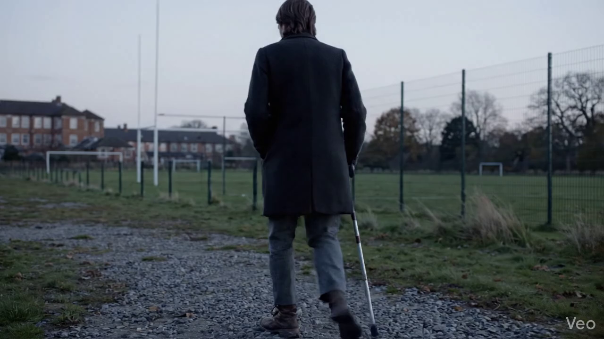
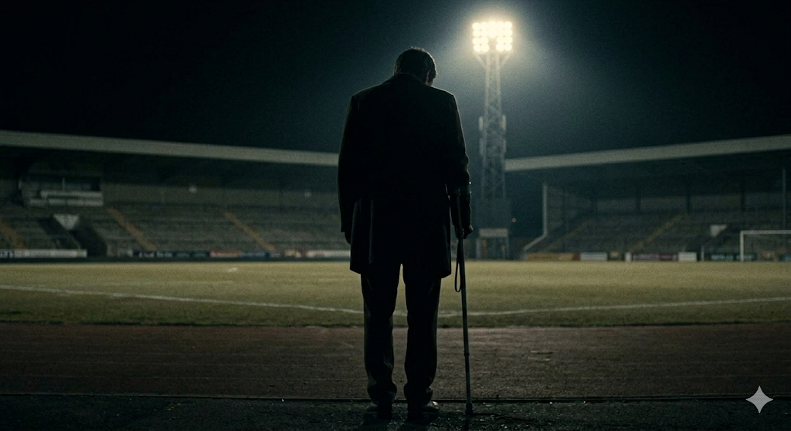
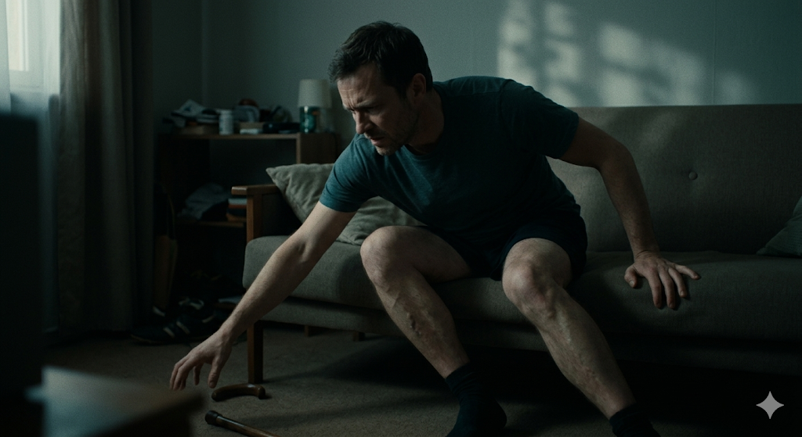
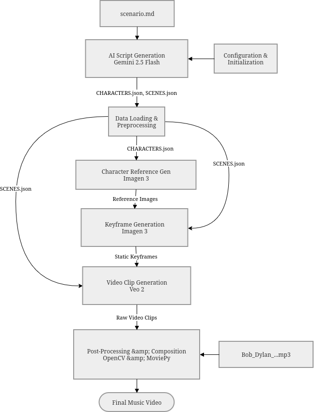

# Project Title: Heavens is where good memories live

## Artistic Statement
I wanted to make a music video for Knockin on heavens door. as how I interpreted the song. its more of a short film, following a man who reflects on his life and finds peace again. the scenes sync with the song.

## The Final Artwork
Here is the final output of the pipeline:


### Example Outputs
you can find all the frames and video under these folders:
 - keyframes/
 - veo_clips/
 - scenes/
 - final/

*(Below are key frames that highlight the consistency and cinematic style generated by the AI pipeline)*





## Technical Architecture Overview
here is the architecture of the pipeline:


### Narrative Overview
The `Knock_pipeline_via_veo.ipynb` notebook implements an automated, AI-driven music video generation pipeline powered by Google Cloud Vertex AI:
1. **Configuration & Initialization**: Sets global properties (FPS, film grain, character references) and directory structures.
2. **AI Script Generation**: Gemini 2.5 Flash analyzes a narrative scenario and outputs a structured shot-by-shot sequence and character bible.
3. **Data Loading & Preprocessing**: The JSON files are parsed into prompt-building dictionaries.
4. **Character Reference Generation**: Imagen 3 generates missing baseline character references from the bible.
5. **Keyframe Generation**: Imagen 3 generates static keyframes for each scene, utilizing the reference images to ensure character consistency.
6. **Video Clip Generation**: Vertex AI's Veo 2 model animates the static keyframes into short video clips based on motion hints.
7. **Post-Processing & Video Composition**: OpenCV and MoviePy combine the clips, apply cinematic effects (letterboxing, film grain, slow zoom), and sync everything with the audio track.

## AI Techniques & Integration

### List of Models
- **Gemini 2.5 Flash**: Used for NLP analysis of the scenario and JSON script generation.
- **Imagen 3 (`gemini-3.1-flash-image-preview`)**: Used for generating character reference images and static scene keyframes.
- **Veo 2 (`veo-2.0-generate-001`)**: Used for text-and-image-to-video generation, animating the keyframes.

### The "Emergent" Interaction
The pipeline relies on a cascading interaction between Large Language Models and Vision/Video Diffusion models. The NLP analysis by Gemini 2.5 Flash acts as the "director," translating the human-written narrative scenario (`scenario.md`) into a structured emotional map and explicit visual prompts. These prompts and motion hints strictly dictate the pacing and camera movements for Veo 2. Furthermore, a feedback loop is established where Imagen 3 generates a character reference image, which is then fed *back* into Imagen 3 as a reference condition for all subsequent scene keyframes, ensuring emergent visual consistency across the entire video sequence.

## Historical Context Integration
this pipeline is not trully context integrated. its creates videos based on scene.json and character.json. which created by script engine. and it creates those files based on scenario.md file. so what ever writen in scenario.md file will be the context of the video. 

currently music that applied to video is knocking on heavens door. song from 1973. but even that is not much integrated. it takes from audio_path varible. so if you were to tweak global config cell and .env file u can do whatever you want.

but Technically, the pipeline enforces a 1970s aesthetic by hard-coding `"Cinematic 1970s film still."` into the base prompt generator. Furthermore, the post-processing engine automatically applies `ADD_FILM_GRAIN` and `ADD_LETTERBOX` to simulate the tactile, gritty quality of 1970s cinema.

## Installation & Setup

### Dependencies
> [!WARNING]
> **API WARNING!**
> I highly recommend **NOT** running this pipeline. It depends heavily on Google Cloud's Vertex AI API (Imagen 3 and Veo 2). which is very hard to entegrate if you are not familiar with. Also these services are **NOT FREE** and can get expensive very quickly. I was able to complete this assignment using free credits.
> 
> If you choose to run this, you **MUST** ensure you have a Google Cloud Project with the Vertex AI API enabled and an active billing account. Proceed at your own financial risk!

- `google-genai`
- `imageio` and `imageio-ffmpeg`
- `moviepy`
- `opencv-python`
- `pillow`
- `google-cloud-storage`

### Execution Instructions
1. **Google Cloud Console Setup**:
   - Go to the [Google Cloud Console](https://console.cloud.google.com/).
   - Create a new project (or select an existing one) and note the Project ID.
   - **Crucial step**: Ensure you have an active **Billing Account** linked to this project (Vertex AI requires billing enabled, even if you are just using free trial/student credits).
   - Enable the **Vertex AI API** for your project.
   - Install the [Google Cloud CLI (`gcloud`)](https://cloud.google.com/sdk/docs/install) on your machine if you haven't already.
   - Run the following command in your terminal to authenticate your local environment (this connects your laptop to the cloud project):
     ```bash
     gcloud auth application-default login
     ```

2. Clone the repository and navigate to the project directory.
3. Install the required Python packages: 
   ```bash
   pip install google-genai imageio imageio-ffmpeg moviepy opencv-python pillow google-cloud-storage
   ```
4. Create a `.env` file in the root directory and set your Google Cloud configuration:
   ```env
   GCP_PROJECT_ID="your-project-id"
   GCP_LOCATION="us-central1"
   ```

5. Place your audio track (`Bob_Dylan_-_Knockin_On_Heaven_s_Door.mp3`) in the project root.
6. Open `Knock_pipeline_via_veo.ipynb` in a Jupyter environment and Run All Cells. The pipeline will automatically create the necessary asset folders, generate the video, and save it to the `final/` directory.

## Authorship & Transparency
- **Human Curation & Direction**: I found the original interpretation of the song, the core narrative concept about the footballer affected by war (`scenario.md`) then polish using ai,I had the idea of the high-level architecture of the Python pipeline but for techincal detials i asked advice from LLMs like claude, chatgpt, gemini on web, and i defined the timing of the scene based on the song's lyrics time stamps which i also write myself.
- **AI-Generated Components**: 

  - the low level code of the pipeline in `Knock_pipeline_via_veo.ipynb` (I still understand the code itself i dont use fuly agentic code creation)
  - The structured JSON prompts and detailed scene breakdowns were generated by Gemini 2.5 Flash.
  - All visual assets (keyframes and character references) were generated by Google Imagen 3.
  - The video animations and motion interpolations were generated by Google Veo 2.

